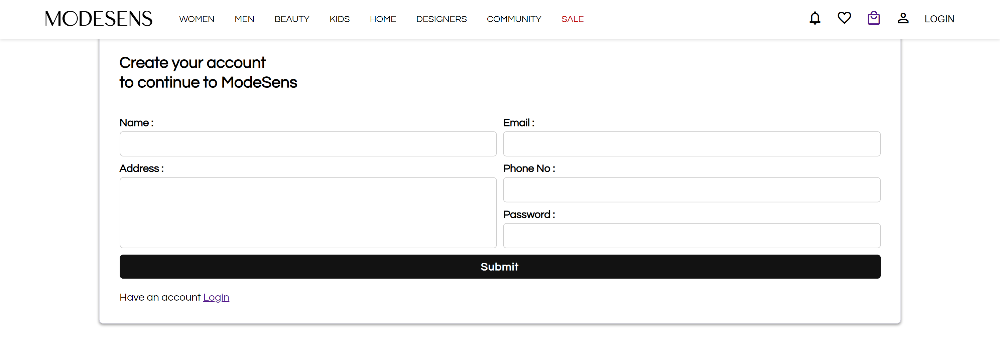
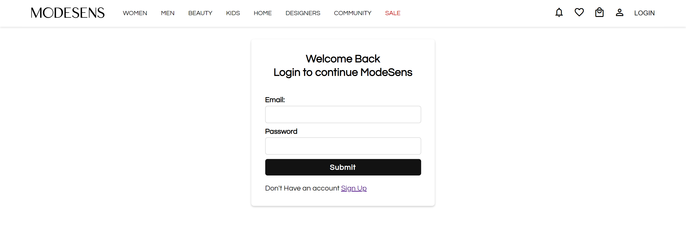
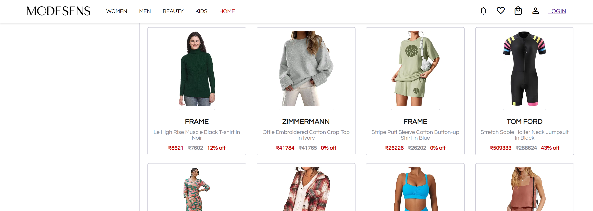

# Freedom-Frameworks_025-
Project for modesens Clone website.

# ModeSens
The ModeSens website clone aims to replicate the key functionalities and user experience of the original ModeSens platform, focusing on delivering a seamless and efficient shopping experience. The clone includes two primary features: the product description page and the wishlist page.

# Project Type
- Frontend | Backend

# Directory Structure
- Freedom-Frameworks-025-/
      └── Modesons/
          ├── index.html         
          ├── style.css
          ├── index.js        
          ├── slider.css    
          ├── images/
          │   ├── carousal1/
          │   │        └── images related to carousal1
          │   │
          │   ├── carousel2/
          │   │          └── images related to carousal2
          │   └── logo / 
          │               └── all logos
          │       
          └──pages/
              ├── AdminalPages/ 
              │      ├──  addproducts/   
              │      │         ├──index.html
              │      │         ├──styles.css
              │      │         └──script.js   
              │      │
              │      ├──  dashboard/    
              │      │         ├──index.html
              │      │         ├──styles.css
              │      │         └──script.js
              │      │
              │      ├──  manageproducts/     
              │      │         ├──index.html
              │      │         ├──styles.css
              │      │         └──script.js
              │      │
              │      ├──  products/ 
              │      │         ├──index.html
              │      │         ├──styles.css
              │      │         └──script.js     
              │      │
              │      └──  users/         
              │               ├──index.html
              │               ├──styles.css
              │               └──script.js 
              ├── allproduct/ 
              │         ├──index.html/
              │         ├──styles.css
              │         └──script.js
              │
              ├── cart/
              │        ├──index.html
              │        ├──styles.css
              │        └──script.js
              │
              ├── checkout/
              │         ├──index.html
              │         ├──styles.css
              │         └──script.js
              │                      
              ├── login/
              │         ├──index.html
              │         ├──styles.css
              │         └──script.js
              │                     
              ├── orders/
              │         ├──index.html
              │         ├──styles.css
              │         └──script.js
              │                       
              ├── productDescription/
              │         ├──index.html
              │         ├──styles.css
              │              └──script.js
              │                      
              ├── signup/
              │       ├──index.html
              │       ├──styles.css
              │       └──script.js
              │                     
              └── wishlist/
                        ├──index.html
                        ├──styles.css
                        └──script.js

# Features 
- Sign-up and sigin user.
- Admin Section
- Add to cart functionality.
- Add and shop products, offers and community section

# SignUp Page
- To order any Product on our website user have to login and then can do any order .
- Signin was achieved with the help of Local storage .
- No user From same ID can signin , he/she have to enter different email ID .
- 

# Login Page
- After successful signin For Authentication he has to login as a valid user so can do any order and can visit website.
- Login is Achieved by Local Storage and after verfication he can proceed to visit website.
- 

# Admin Page
- Login Id - admin@gmail.com, Password- admin.
- Admin Can add product and can remove the product through this page
- 

# Home page 
- User can see all the Glimse of fashion on home page and there are several carausel which make website more attractive .
- Home page carausel which was devlop with help on js itself.
- 

# Women 
- User can do shopping by category , also User have good access to category .
- so womens have to directytly had toward the women page can do shopping .
- 

# Mens
- Website also have mens page wher mens can search on differentnt product and do shooping .
- All the product are shown with the help carausel in unique the eye catching Mannner .
- .png>)
  
# Kids
-Category can be sort according to men , women , kids in kids page .
-If user wnat to do shopping with the hepl of sorting can do that thing also .
- .png>)

